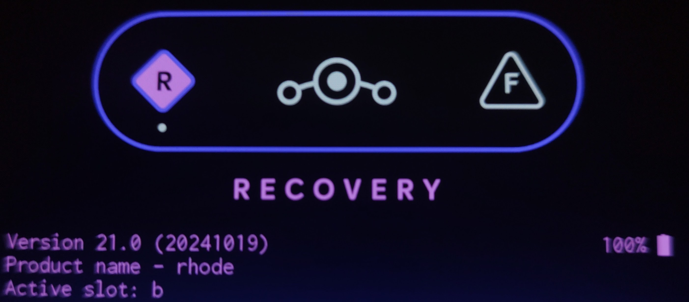
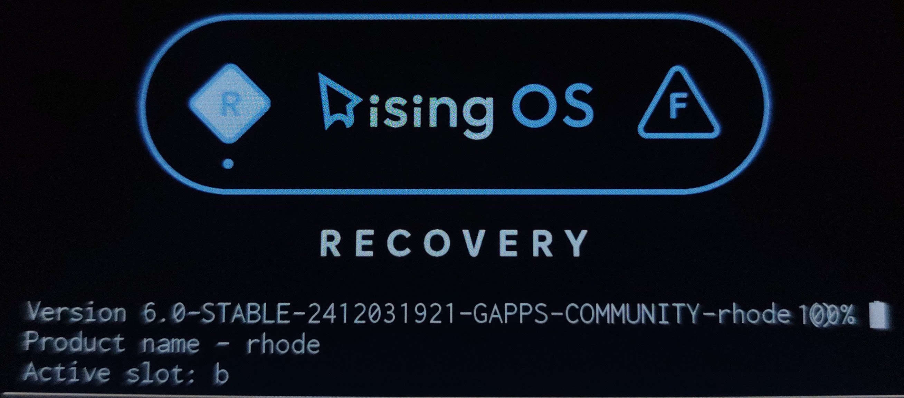

import { Steps } from '@astrojs/starlight/components';
import { LinkCard } from '@astrojs/starlight/components';
import { Aside } from '@astrojs/starlight/components';
import { Badge } from '@astrojs/starlight/components';
import { FileTree } from '@astrojs/starlight/components';
import { LinkButton } from '@astrojs/starlight/components';

Este método está dirigido principalmente a los dispositivos Motorola Moto G32/G42/G52/G200

## Paso 1: Descargar los controladores USB de Motorola

<Steps>

1. Abra su navegador web y descargue los controladores USB de Motorola desde la página oficial de descargas:

   <LinkCard title="Motorola USB Drivers" href="https://en-us.support.motorola.com/app/usb-drivers" />

2. Haga clic en **"Descargar"** para su sistema operativo.

3. Abra el archivo descargado e instálelo.

</Steps>

<Aside>Los sistemas operativos basados en GNU/Linux ya contienen controladores usb. No es necesario realizar una instalación en estos sistemas.</Aside>

## Paso 2: Descargar Recovery/Kernel

Los recovery personalizados se instalan en la partición <Badge text="boot.img" variant="note" /> del dispositivo, 
pero para que este cargue correctamente debe ser compatible con las particiones <Badge text="vendor_boot.img" variant="note" /> y <Badge text="dtbo.img" variant="note" />, 
por lo que necesitamos instalar las tres particiones para tener una recuperación funcional.

<FileTree>

- files
  - boot.img (Aqui se almacenan el kernel y recovery)
  - vendor_boot.img (Aqui se almacenan los modulos del kernel)
  - dtbo.img (Aqui la configuracion de los modulos)

</FileTree>

<LinkButton
  href="https://sourceforge.net/projects/zetlink-files/files/RisingOS/5.2.1-Oct/Recovery-Devon/"
  variant="minimal"
  icon="external"
  iconPlacement="start"
>
  Recovery G32
</LinkButton>
<LinkButton
  href="https://sourceforge.net/projects/zetlink-files/files/RisingOS/5.2.1-Oct/Recovery-Hawao/"
  variant="minimal"
  icon="external"
  iconPlacement="start"
>
  Recovery G42
</LinkButton>
<LinkButton
  href="https://sourceforge.net/projects/zetlink-files/files/RisingOS/5.2.1-Oct/Recovery-Rhode/"
  variant="minimal"
  icon="external"
  iconPlacement="start"
>
  Recovery G52
</LinkButton>
<LinkButton
  href="https://sourceforge.net/projects/zetlink-files/files/RisingOS/5.2.1-Oct/Recovery-Xpeng/"
  variant="minimal"
  icon="external"
  iconPlacement="start"
>
  Recovery G200
</LinkButton>

## Paso 3: Instalar Recovery/Kernel

Para realizar la instalación debes tener ADB/Fastboot instalado en tu pc. Puedes consultar la siguiente guía para realizar la instalación. [Instalar ADB/Fastboot](/es/extra/install-adb/).

<Steps>

1. Habilita las **"Opciones para desarrolladores"** de tu sistema y activa la **"Depuración por USB"**.

2. Conecta tu dispositivo a través de USB, si aparece un mensaje diciendo **"¿Permitir depuración por USB?"** haz clic en **"Permitir"**.

3. Reinicia tu dispositivo al bootloader

   ```sh
   adb reboot bootloader
   ```
4. Instale el recovery con los siguientes comandos.

   ```sh
   fastboot flash boot boot.img
   fastboot flash vendor_boot vendor_boot.img
   fastboot flash dtbo dtbo.img
   ```
5. Reinicia el dispositivo al recovery

   ```sh
   fastboot reboot recovery
   ```
</Steps>

## Paso 4: Instalar ROM personalizada

<Aside type="tip">

Este paso sólo se realiza si usted está en Stock ROM y desea instalar una ROM personalizada. Instala el archivo <Badge text="copy-partitions-20220613-signed.zip" variant="note" />.
Puede descargar el archivo desde [Aqui](https://mirrorbits.lineageos.org/tools/copy-partitions-20220613-signed.zip). Seleccione **"Apply Update"** y, a continuación, utilice el siguiente comando:

```sh
   adb sideload copy-partitions-20220613-signed.zip
```

Finalmente selecciona **"Advanced"** y luego **”Reboot to recovery"**.
</Aside>

<Steps>

1. Haga clic en **"Apply Update"** y luego en **”Apply from ADB"**:

   ```sh
   adb sideload rom.zip
   ```

   <Aside>Si el proceso se detiene o termina en el 47%, no se preocupe, es normal.</Aside>
   <Aside>
    Cuando aparece el cartel que dice:
    
    <Badge text="Signature validation failed Install anyway?" size="medium" variant="danger" />
    Haga clic en **"Yes"** y espere a que finalice la instalación.
   </Aside>

2. Selecciona **"Advanced“** y luego **”Reboot to recovery"**.
   <Aside>
    A veces puede aparecer un mensaje diciendo:
    <Badge text="To install additional packages, it is necessary to restart the recovery first do you want to restart in recovery mode?" size="medium" variant="danger" />
    Seleccione **"Yes"**.
   </Aside>

3. <Badge text="(Optional)" variant="caution" /> Si tu rom es vanilla y quieres instalar gapps, puedes instalarla de la misma forma que la custom rom.
   ```sh
   adb sideload gapps.zip
   ```
   A continuación, reinicie de nuevo al recovery.

4. Finalmente selecciona **"Factory reset“** y luego **”Format data/factory reset“** y reinicia el sistema con **”Reboot system now"**. 

</Steps>

<Aside>Al finalizar la instalacion de la Custom ROM el recovery se vera reemplazado por el recovery de la Custom ROM instalada.</Aside>

## Extra: Errores a los que puede enfrentarse:

### Downgrade SPL error

<Aside type="danger">
 ERROR: recovery: Current SPL: XXXX-XX-XX Target SPL: XXXX-XX-XX this is considered a downgrade \
 ERROR: recovery: Denying OTA because it's SPL downgrade
</Aside>

> Estp ocurre cuando intentas instalar una rom con una fecha anterior a la indicada por el recovery. \
¿Cómo puedo saber cuál es la fecha de mi recovery? \
**Example 1:**
 
La fecha de este recovery es: **(20241019)** Año: 2024 , Mes: 10, Dia: 19. \
**Example 2:**
 
La fecha de este recovery es: **2412031921** Año: 2024 , Mes: 12, Dia: 03, Hora: 19, Minutos: 21.

#### Solucion
Deberías buscar un recovery con una fecha anterior a la Custom ROM que estás intentando instalar o utilizar un recovery alternativo como TWRP o OrangeFox.