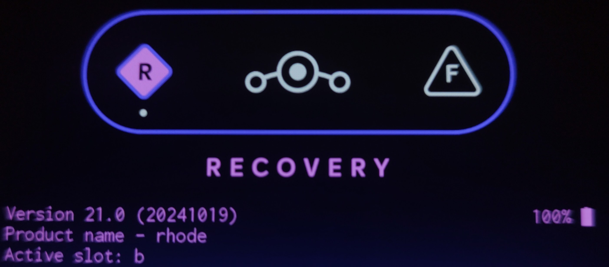
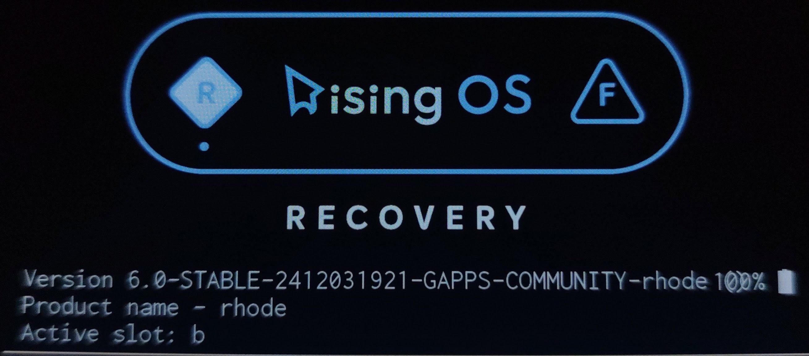

import { Steps } from '@astrojs/starlight/components';
import { LinkCard } from '@astrojs/starlight/components';
import { Aside } from '@astrojs/starlight/components';
import { Badge } from '@astrojs/starlight/components';
import { FileTree } from '@astrojs/starlight/components';
import { LinkButton } from '@astrojs/starlight/components';

This method is mainly aimed at Motorola Moto G32/G42/G52/G200 devices

## Step 1: Download Motorola USB Drivers

<Steps>

1. Open your web browser and download Motorola USB Drivers from official download page:

   <LinkCard title="Motorola USB Drivers" href="https://en-us.support.motorola.com/app/usb-drivers" />

2. Click on **"Download"** for your operating system.

3. Open the downloaded file and then install it.

</Steps>

<Aside>GNU/Linux based operating systems already contain usb drivers. It is not necessary to perform an installation on these systems.</Aside>

## Step 2: Download Recovery/Kernel

Custom recoveries are installed in the <Badge text="boot.img" variant="note" /> partition of the device, 
but for this to load correctly it must be compatible with the <Badge text="vendor_boot.img" variant="note" /> and <Badge text="dtbo.img" variant="note" /> partitions, 
so we need to install all three partitions to have a functional recovery.

<FileTree>

- files
  - boot.img (This is where the kernel and recovery are stored)
  - vendor_boot.img (This is where the kernel modules are stored.)
  - dtbo.img (Here is the configuration of the modules)

</FileTree>

<LinkButton
  href="https://sourceforge.net/projects/zetlink-files/files/RisingOS/5.2.1-Oct/Recovery-Devon/"
  variant="minimal"
  icon="external"
  iconPlacement="start"
>
  Recovery G32
</LinkButton>
<LinkButton
  href="https://sourceforge.net/projects/zetlink-files/files/RisingOS/5.2.1-Oct/Recovery-Hawao/"
  variant="minimal"
  icon="external"
  iconPlacement="start"
>
  Recovery G42
</LinkButton>
<LinkButton
  href="https://sourceforge.net/projects/zetlink-files/files/RisingOS/5.2.1-Oct/Recovery-Rhode/"
  variant="minimal"
  icon="external"
  iconPlacement="start"
>
  Recovery G52
</LinkButton>
<LinkButton
  href="https://sourceforge.net/projects/zetlink-files/files/RisingOS/5.2.1-Oct/Recovery-Xpeng/"
  variant="minimal"
  icon="external"
  iconPlacement="start"
>
  Recovery G200
</LinkButton>

## Step 3: Install Recovery/Kernel

To perform the installation you must have ADB/Fastboot installed on your pc. You can refer to the following guide to perform the installation. [Install ADB and Fastboot](/extra/install-adb/).

<Steps>

1. Enable the **"Developer options"** on your system and activate **"USB debugging"**.

2. Connect your device via USB, if you get a message saying **“Allow USB debugging?”** click **"Allow"**.

3. Reboot your device to bootloader

   ```sh
   adb reboot bootloader
   ```
4. Install the recovery with the following commands.

   ```sh
   fastboot flash boot boot.img
   fastboot flash vendor_boot vendor_boot.img
   fastboot flash dtbo dtbo.img
   ```
5. Reboot your device to recovery

   ```sh
   fastboot reboot recovery
   ```
</Steps>

## Setp 4: Install Custom ROM

<Aside type="tip">

This step is only done if you are on Stock ROM and want to install a Custom ROM. Install the copy-partitions-20220613-signed.zip file. You can download the file from [Here](https://mirrorbits.lineageos.org/tools/copy-partitions-20220613-signed.zip). Select “Apply Update” and then use the following command:

```sh
   adb sideload copy-partitions-20220613-signed.zip
```

Finally select **"Advanced"** and then **"Reboot to recovery"**.
</Aside>

<Steps>

1. Click on **"Apply update"** and then **"Apply from ADB"**:

   ```sh
   adb sideload rom.zip
   ```

   <Aside>If the process stalls or ends at 47%, do not worry, it is normal.</Aside>
   <Aside>
    When it appears in carter it says:
    
    <Badge text="Signature validation failed Install anyway?" size="medium" variant="danger" />
    Click **Yes** and wait for the installation to finish.
   </Aside>

2. Select **"Advanced"** and then **"Reboot to recovery"**.
   <Aside>
    Sometimes you may see a message saying:
    <Badge text="To install additional packages, it is necessary to restart the recovery first do you want to restart in recovery mode?" size="medium" variant="danger" />
    Select **Yes**.
   </Aside>

3. <Badge text="(Optional)" variant="caution" /> If your rom is vanilla and you want to install gapps, you can install it the same way as the custom rom.
   ```sh
   adb sideload gapps.zip
   ```
   Then reboot to recovery.

4. Finally select **“Factory reset”** and then **“Format data/factory reset”** and reboot the system with **“Reboot system now”**. 

</Steps>

<Aside>At the end of the installation of the Custom ROM the recovery will be replaced by the recovery of the installed Custom ROM.</Aside>

## Extra: Mistakes you may face:

### Downgrade SPL error

<Aside type="danger">
 ERROR: recovery: Current SPL: XXXX-XX-XX Target SPL: XXXX-XX-XX this is considered a downgrade \
 ERROR: recovery: Denying OTA because it's SPL downgrade
</Aside>

> It happens when you try to install a rom with a date prior to that indicated by the recovery. \
How can I know what is the date of my recovery? \
**Example 1:**
 
The date of this recovery is **(20241019)** Year: 2024 , Month: 10, Day: 19. \
**Example 2:**
 
The date of this recovery is **2412031921** Year: 2024 , Month: 12, Day: 03, Hour: 19, Minutes: 21.\

#### Solution
You should look for a recovery with an earlier date than the Custom ROM you are trying to install or use an alternative recovery such as TWRP or OrangeFox.